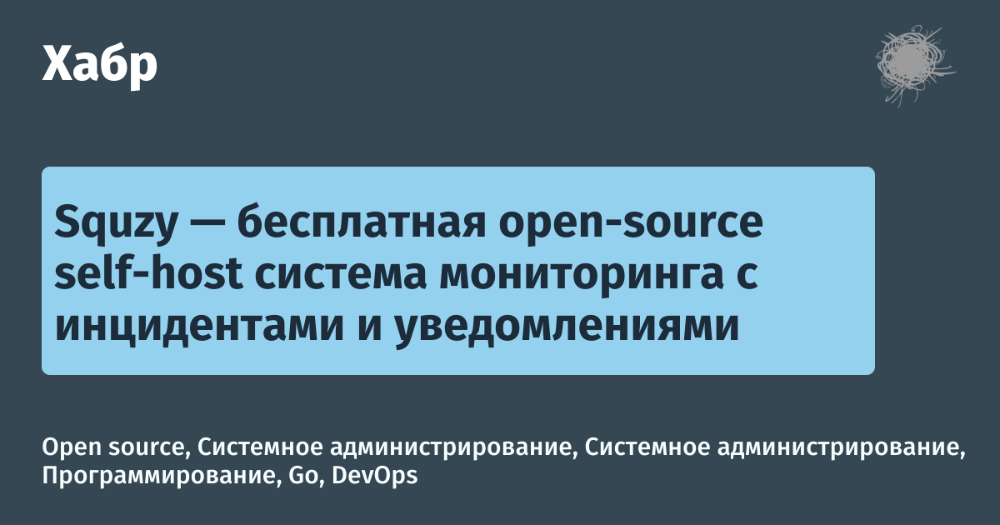

# A generation server for preview images

You can set:

- fonts
- own colors

## Demo




## Install

```
go build server.go
./server
```

Used links for demos:

```
http://localhost:3000/?backgroundColorHex=372b94&disableLogo=yes&sourceName=The%20Verge&sourceNameColorHex=e2127A&title=PSA:%20Games%20Done%20Quick%E2%80%99s%20summer%20speedrunning%20event%20kicks%20off%20on%20August%2016th&titleBackgroundColorHex=424242&titleColorHex=ffffff&category=Games&categoryColorHex=ffffff

http://localhost:3000/?backgroundColorHex=354753&sourceName=%D0%A5%D0%B0%D0%B1%D1%80&sourceNameColorHex=FFFFFF&title=Squzy%20%E2%80%94%20%D0%B1%D0%B5%D1%81%D0%BF%D0%BB%D0%B0%D1%82%D0%BD%D0%B0%D1%8F%20open-source%20self-host%20%D1%81%D0%B8%D1%81%D1%82%D0%B5%D0%BC%D0%B0%20%D0%BC%D0%BE%D0%BD%D0%B8%D1%82%D0%BE%D1%80%D0%B8%D0%BD%D0%B3%D0%B0%20%D1%81%20%D0%B8%D0%BD%D1%86%D0%B8%D0%B4%D0%B5%D0%BD%D1%82%D0%B0%D0%BC%D0%B8%20%D0%B8%20%D1%83%D0%B2%D0%B5%D0%B4%D0%BE%D0%BC%D0%BB%D0%B5%D0%BD%D0%B8%D1%8F%D0%BC%D0%B8&titleBackgroundColorHex=94d1ee&titleColorHex=1d2c3a&category=Open%20source,%20%D0%A1%D0%B8%D1%81%D1%82%D0%B5%D0%BC%D0%BD%D0%BE%D0%B5%20%D0%B0%D0%B4%D0%BC%D0%B8%D0%BD%D0%B8%D1%81%D1%82%D1%80%D0%B8%D1%80%D0%BE%D0%B2%D0%B0%D0%BD%D0%B8%D0%B5,%20%D0%9F%D1%80%D0%BE%D0%B3%D1%80%D0%B0%D0%BC%D0%BC%D0%B8%D1%80%D0%BE%D0%B2%D0%B0%D0%BD%D0%B8%D0%B5,%20Go,%20DevOps&categoryColorHex=f7fefe
```
